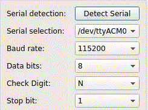

# SerialHelper

## First thing first
- This project is to create a simple tools to improve development efficiency in serial
- This project is based on another project,but it i forget where i see,so someday if you see this, contact me.

## Usage
python SerialHelper.py

## what it can do

### Detect Serial Port Automatically

### Receiving data and show

### Send data and send data regularly

### Count the number of sent and received data

### Real-time Drawing

## License
MIT License
